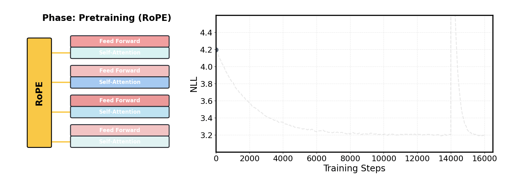

<h1 align="center">
  <a href="https://github.com/SakanaAI/DroPE">
</a><br>
<b><u>DroPE</u>: Extending the Context of Pretrained LLMs by <u>Dro</u>pping Their <u>P</u>ositional <u>E</u>mbeddings</b><br>
</h1>

<p align="center">
  🤗 <a href="https://huggingface.co/SakanaAI">Models</a> | 
  📚 <a href="https://arxiv.org/abs/2512.12167">Paper</a> | 
  📝 <a href="https://sakana.ai/DroPE/">Blog</a> | 
  🐦 <a href="https://twitter.com/SakanaAILabs">Twitter</a>
</p>
<p align="center">
  
</p>

This repository provides the code for the paper [Extending the Context of Pretrained LLMs by Dropping Their Positional Embeddings](https://arxiv.org/abs/2512.12167).

---

## Overview

### Installation

1) Create environment (Python 3.10+ recommended, tested with Python 3.11) and install deps:
```bash
conda create -n drope python=3.11 -y && conda activate drope
pip install --upgrade pip
./scripts/install.sh
```

2) (Optional) Login to Hugging Face and W&B:
```bash
huggingface-cli login    # if you need gated datasets/models
wandb login              # if you want online logging
```

### Interlude (hydra)
This project uses [Hydra](https://hydra.cc/) for configuration management. Hydra is a library for managing complex configurations. It allows you to store configurations, load them using a simple API, and override them with command line arguments.

---

## Inference

Our models follow HuggingFace's model loading API. For example, to load a DroPE model, you can use the following code:
```bash
from transformers import AutoModel, AutoTokenizer

tokenizer = AutoTokenizer.from_pretrained('SakanaAI/SmolLM-360M-DroPE', trust_remote_code=True)
model = AutoModel.from_pretrained('SakanaAI/SmolLM-360M-DroPE', trust_remote_code=True, torch_dtype=torch.bfloat16)
```

Inference is then straightforward:
```bash
inputs = tokenizer("Hello, world!", return_tensors="pt")
outputs = model.generate(**inputs, max_new_tokens=100)
print(tokenizer.decode(outputs[0], skip_special_tokens=True))
```

---

## DroPE Trainer

Recalibrate a pretrained model to a DroPE model. Currently, the repo contains training configs for the following models:
  - [SmolLM-360M](https://huggingface.co/HuggingFaceTB/SmolLM-360M)
  - [SmolLM-1.7B](https://huggingface.co/HuggingFaceTB/SmolLM-1.7B)
  - [SmolLM-2-1.7B](https://huggingface.co/HuggingFaceTB/SmolLM-2.1-1.7B)
  - [LLaMA-2-7B](https://huggingface.co/meta-llama/Llama-2-7b-hf)

To add a new training config, create a new run-config in `cfgs/run_cfg/`. You can use the existing configs as a template and override the desired settings such as the model, dataset, training hyperparameters, etc. To add support for a new model, add the model to the `MODEL_ARCH_MAP` in `custom_models/drope.py` and create a new model config in `cfg/model_cfg/`.

### Launching a training run

Use the launch helper which wraps `accelerate launch` and selects a DeepSpeed config based on the command line arguments.

- **Command:**
```bash
./launch.sh <num_gpus> <run_config.yaml> <zero_config>
```

- **Arguments:**
  - `<num_gpus>`: number of processes (e.g., 8 for 8 GPUs on one node)
  - `<run_config.yaml>`: the Hydra run-config in `cfgs/run_cfg/`
  - `<zero_config>`: choose either `zero1` (ZeRO-1), `offload_optim` (ZeRO-3 and optimizer only to CPU), or `offload` (ZeRO-3 and model weights to CPU)

This starts training with the defaults from the run-config and computes `gradient_accumulation_steps` to satisfy the requested global `train_batch_size`.

### Customizing runs
You can pass Hydra overrides after the first three arguments. E.g.:

- **Change batch sizes and steps:**
```bash
./launch.sh 8 smollm_drope/recalibration_30B.yaml zero1 \
  train_batch_size=512 \
  per_device_train_batch_size=32 \
  max_steps=120000
```

### Troubleshooting

If you encounter cryptic errors or stack traces from Hydra, set the environment variable `HYDRA_FULL_ERROR=1` to get a full traceback. This is especially helpful for debugging configuration or instantiation issues.

Example:
```bash
HYDRA_FULL_ERROR=1 ./launch.sh 8 llama2_7b_drope.yaml zero1 \
  train_batch_size=512 \
  per_device_train_batch_size=32 \
  max_steps=120000
```

---

## Citation
If you find this code useful, please cite as:
```bibtex
@article{gelberg2025extending,
  title={Extending the Context of Pretrained LLMs by Dropping Their Positional Embeddings},
  author={Gelberg, Yoav and Eguchi, Koshi and Akiba, Takuya and Cetin, Edoardo},
  journal={arXiv preprint arXiv:2512.12167},
  year={2025}
}
```
